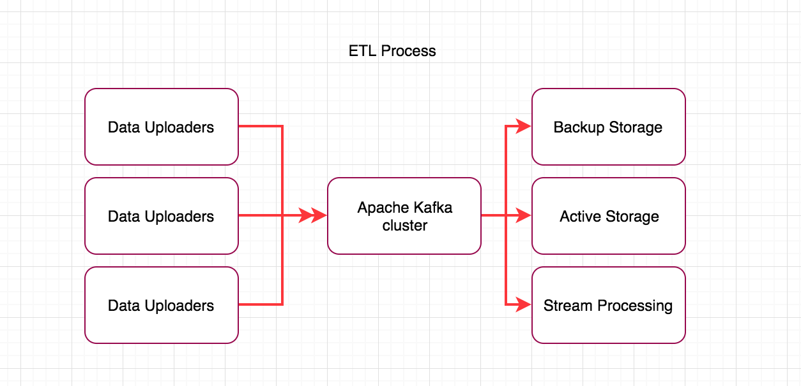
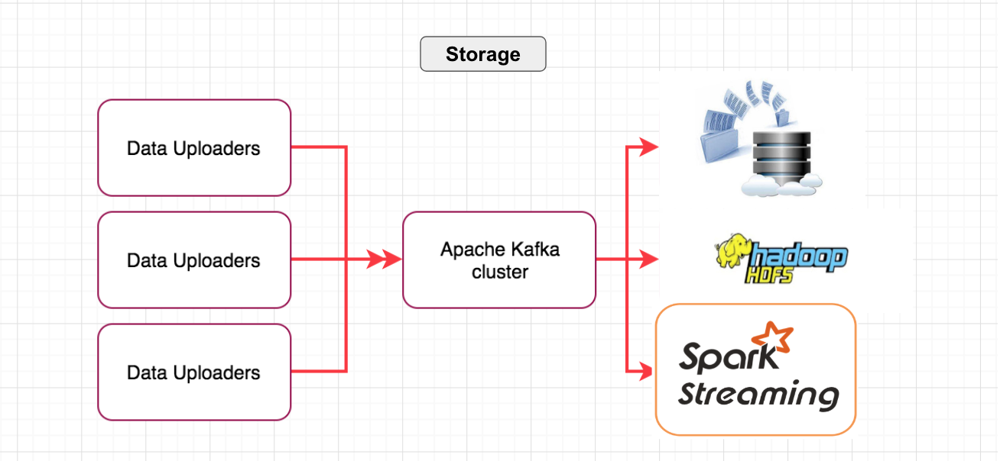
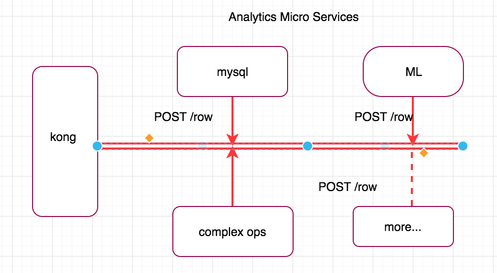
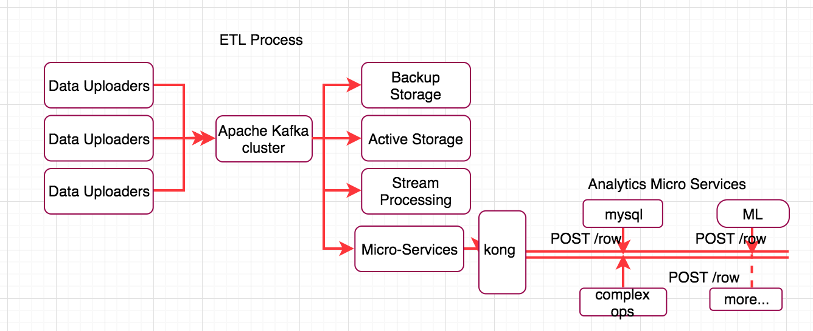
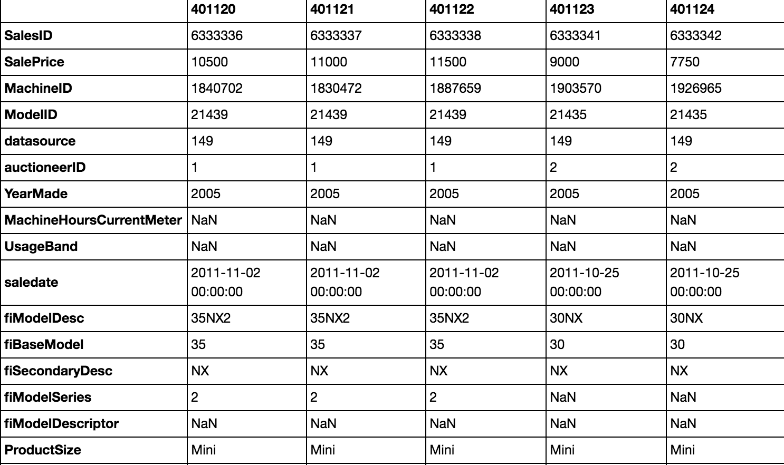
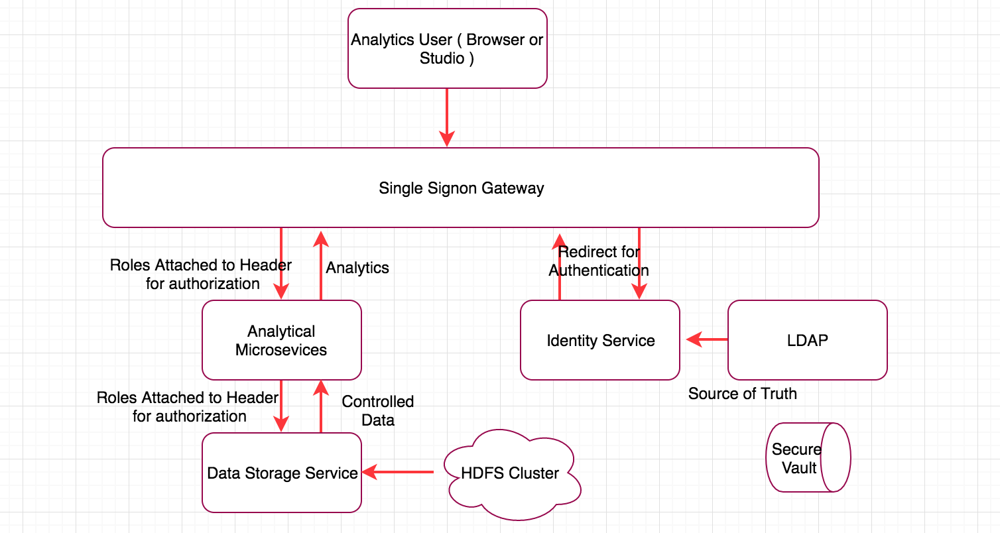
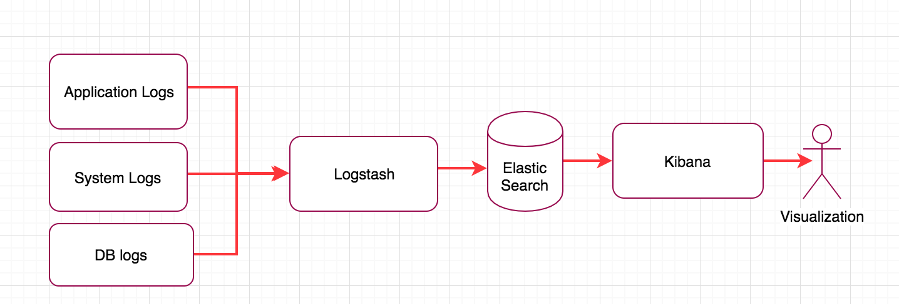
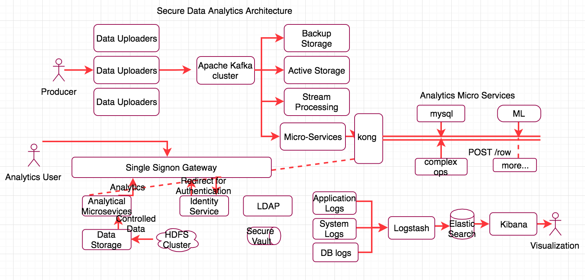

# Designing BigData Secure Analytical System

## Feature Statement

To design a cloud agnostic secure bigdata analytics system with following requirements:

* Scalable and Secure ETL
* Resilient and Fault-tolerant System
* Security and ACL
* Data Lineage and Monitoring
* Data Versioning

## Designing Scalable ETL

Apparently, ETL in a bigdata environment is challenged not only by the volume, velocity and varsity of data but also streaming and transformational capabilities one needs to implement before storing the input. Overall, the design needs to be loosely coupled, flexible and secure.

.Generally speaking, ETL transformation logic can be viewed as <math><mn>N</mn><mo>:</mo><mn>M</mn></math> operation which has following explanation:

| N  | M  | Explanation   |
|:-- |:--:| -------------|
| 0  | 0  | Every input tuple pushed is dropped |
| 1  | 1  | Normal ETL process (store what received ) |
| N  | 1  | Merge N streams onto 1 output stream |
| 1  | M  | Breaking input tuple into multiple output tuple streams |
| N  | M  | Generalizing the above scenarios |

A more interesting senario is <math><mn>N</mn><mo>:</mo><mn>M</mn><mo>:</mo><mn>M</mn><mi>_T</mi></math> where initial transformation are followed by futher ops on the data, need not be real-time. However, this can be different from normal ETL transformations and can include:

* logging, timestamping ETL information.
* creating dataset meta information ( e.g column types, parsing datetimes).
* discovering data-levels and cardinality.
* applying hot-encoding on categorical fields.
* Anonymizing critical fields before storage.

Primarily, these ops can be used for security, data lineage, audit and further analytics. 

### ETL Architectural Design

Such ETL architecture should have following principles in mind:

* loosly coupled
* single responsibility principle
* autonomous
* scalable
* fault-tolerant
* scalable

A simplified ETL architecture can use **Apache Kafka** as a streaming platform along with Data Producers and Consumer.

There are several advantages of using Apache Kafka as a broker:

* data producers and consumers are agnostic of one another.
* store streams of records in a fault-tolerant durable way.
* process streams as a go.
* scale as a cluster.
* enable multiple streams as topics. 

To design a pratical analytical system, one can choose storage mechanism Kafka consumers:

* HDFS 
* Elastic Search / Cassendra
* Streaming Services

#### Kafka Consumers

Connecting back on what we discussed initially about ETL transformation logic ie <math><mn>N</mn><mo>:</mo><mn>M</mn></math>, the case where <math><mn>N</mn><mo>=</mo></math>1,<math><mn>M</mn><mo>=</mo></math>1 can be easily served by HDFS or Elastic Search / Cassendra storage. The Kafka consumers can push the data for storage for further applications to consume. Furthermore, the Kafka consumers can uniquely anonymize, encrypt, compress or drop fields on reading some meta information. This can secure data at rest. We will discuss more on security later. 

Interestingly, HDFS storage can be used for <math><mn>N</mn><mo>:</mo><mn>1</mn></math> where multiple streams are merged into one. A simple scenario is to store multiple input streams in the same time granularity so that they can be analyzed together. One can create HDFS directory paths with timestamps to store data. For instance,  `<data_path>/yyyy/mm/dd/hh` can store hourly bins of data from multiple streams. ( an vice-versa <math><mn>N</mn><mo>:</mo><mn>1</mn></math> )

In addition, ETL logic such as <math><mn>N</mn><mo>:</mo><mn>1</mn></math> can support multiple transformations using Kafka streaming services :

* aggregation and average computations (window sliding)
* pivot

More general case <math><mn>N</mn><mo>:</mo><mn>M</mn></math> may need a flexible framework for data analytics as one can neither anticipate the sorts of analytical functions may apply nor can be removed/added on demand.  Few analytical functions which may be useful are:

* random sampling input data.
* statistics. 
* building an online machine learning model.
* enriching input row with external information.
* complex operations (union, merging columns, conditional split).

We propose a microservice framework to achieve the above capability. Each microservice designed as **high cohesion** and **bounded context**, which means related behavior sits at one place and can be accessed through well defined interface. Moreover, these microservices can apply ACL controls and restrictions to secure the system.

Microservices can be implemented as docker containers is shown below: 
 

##### Kong
Kong is API gateway acts as a middleware between API access and computation. Kong include authentication, security, traffic control, serverless, analytics & monitoring, request/response transformations and logging. 

The purpose of Kong is two fold: 

* it provides monitoring for fine-grained ETL process.
* further, it can provide controlled access to consumers of data while performing analytics which we will discuss further.

Docker containers like mysql, complex ops can be used for storing and implementing algorithms results.

The following gives the combined ETL pipeline architecture plugged with flexible microservices framework.

## Resilient and Fault-tolerant System
Today distributed data storage framework come with redundancy and fault tolerance. Hadoop File System by default makes 3 copies of data block within this system and Elastic Search can easily be clustered onto multiple machines. Scalability at storage-level can easily be handled.

Interestingly, microservices are designed with resilency in mind, if one service crashes it may not lead to cascade failure. One can isolate the problem and deploy the patch for that microsergices in a running system with zero downtime. Unfortunately, this flexibility is missing in monolithic bigdata system.

Furthermore, Apache Kafka makes the ETL pipe highly durable. It persists all data records in the cluster of machines for a configurable period based on rentention policy. It functions by creating a loose coupling between producers and consumers. This means that producers and consumers can come and go do not need to be synchronized.

## Securing System

So far we have discussed only the scalabilty, enterprise systems that store customer data need to be made secure. Although important, in this section we will not discuss general preventive measures like enabling Firewall, constant port scanning or IDS system to active monitor for anomalies or DOS attack or further provision the system with VPC (Virtual Private Cloud) for network isolation.

The security aspect should be considered in design are:

* secure connections between entities.
* authentication as single sign-on services.
* coarse-grained / fine-grained authentication.
* encrypting data at rest and decrypting on demand.
* secure API access.

##### Apache Kafka Built-in Security Features

* Authentication of connections to brokers from producers and consumers using SSL.
* Encryption of data transferred between brokers and clients using SSL.
* Authorization of read / write operations by producers and consumers.

##### Single Sign-On
The ETL system may rely on common single sign-on system for authentication, essentially trusting ie the subsystem. In our design we chose not authentiate the subsystem further. We set network perimeters and once the user has been authenticated the rest of system is accessible. However, to give meaningful data access for analytics we need to implement identity service which authorize data usage. The authorization should be part of every subsystem. 

##### Data Authorization
In any system there are multiple level of authorization possible either related to a coarse-grained resource / service or more fine-grained such as data access.

We didnt talk much about all the features of analytical system but it has have two distinct types of users. 

* one that upload the datasets.
* another that use the third party datasets.

Without going into setup details, the latter users of an analytical system have well defined roles which are added by an identity service usually set by systen admins. 

Apparently, the authorization also links to the business usecase if one should not be given access to raw data. However, this is different from ETL access to read raw data from Apache Kafka externally or exposing API to access databases or filesytem externally. Our design disables access to raw dataset.

What is interesting is how authorization plays a role at the analytics or statistical level when accessing data fields to get something insightful. Essentially, one can define roles such that users who will analyze the data:

* have fine-grained access to data columns
* or have fine-grained access certain values of a data column.

Lets consider sales dataset of heavy machines as an example ( given below ) to illustrate fine-grained access.

CASE 1: There may be a set of users e.g factory supervisors who may not have access to **Sales Price**,**SalesID** and **auctioneerID**  but rest of the columns to analyze what attributes of a machine. 

CASE 2: On the otherhand, there may be another set of users e.g sales guys who are authorized access to certain values in column but not the complete access to that column like **fiBaseModel** ( one may have access to machine model no. 35 another to 30). Each sales personal use different machine models to predict the future sales.

In summary, these authorization ACL will dictate how analytics output is calculated and visualized.

##### Authorization with subsystem via JWT

In our design this can be facilitated by Kong API gateway once the analytics user is authenticated with a username and password ( or 2 factor authentication ). Kong will generate JWT token and pass it along to analytical microservices in HTTP header to downstream services which use it to get proper ACL list via Identity services to filter or skip data columns and values.

This figure will give details on both authentication and authorization for external and internal entity.

## Data Lineage and Monitoring

Fortunately, our design is flexible to cater both data lineage and monitoring needs for audit and security purpose. The data movement is easy to capture because the subsytem ( producers, consumers and microservices ) can log details the activity. The logs can be time stamped keeping all the information in databases. 

There can be multiple types of logs:
* System Logs
* Application Logs
* DataBase Logs

##### Logging Service
One can design a separate logging service which the rest of system can use to log results. It can log the data capture movements, encryption and decryption details along with any rouge access.

However, there is always an hassle to analyze huge amount of logs probing and finding errors. Fortunately, Logstash and Kibana can come to rescue. Log stash can parse multiple logfile formats and can send them to downstream systems for further investigation. On the other hand Kibana which uses Elastic Search has backend system can help query and search for potential security holes in logs. 

This is how log service would look like

## Data Versioning

Data Versioning is not a problem either in our design as we use Apache Kafka with provides timestamp information. These can be used to create multiple versions of same dataset. Storing in HDFS may require providing additional information in `<data_path>/yyyy/mm/dd/hh`.

## Putting All Together
This is how the complete architecture would look like. 

However, this architecture is not complete in entirely. It misses out a big chunk on how analytics should be peformed on data. However, analytics can be visualized or how this design can be scaled on multi VMs. Security needs more careful checks and hardening of the system. 
